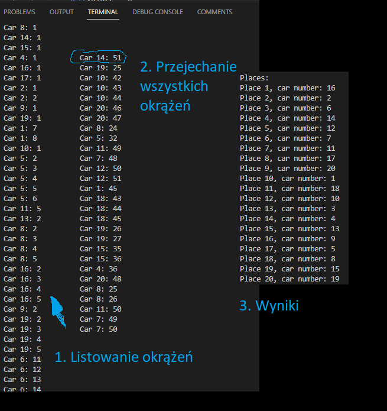

# Wyścig samochodowy

## Opis projektu
Celem projeku było zastosowanie i zwizualizowanie wątków, które będą walczyć o dostęp do danej sekcji krytycznej. Projekt jest prostą symulacją wyścigu samochodowego, w którym bierze udział 20 samochodów.

## Wizualizacja

1. Listowanie okrążeń\
Każdy samochód to inny wątek. Samochody naprzemiennie walczą o dostęp do sekcji krytycznej. Wszystkie 20 samochodów bierze udział w wyścigu, którego celem jest jak najszybsze przejechanie 51 okrążeń.

2. Przejechanie wszystkich okrążeń\
W momencie, gdy jakiś samochód przejedzie 51 okrążeń, nie będzie już walczył o dostęp do kolejki.

3. Wyniki\
Na sam koniec przedstawione są wyniki. Widać na nich, który samochód przyjechał jako pierwszy, a który jako ostatni.

## Wątki i sekcje krytyczne

* Wątki i co reprezentują\
W programie znajduje się 20 wątków, które reprezentują samochody biąrące udział w wyścigu, kążdy samochód ma przydzielony numer od 1 do 20. Wątki ścigają się o dostęp do sekcji krytycznej. Liczba udanych dostępów do sekcji krytycznej oznacza liczbę pokonanych przez dany samochód okrążęń.

* Sekcje krytyczne\
O dostęp do niej ścigają się wątki reprezentujące samochody. W danym momencie dostęp do sekcji krytycznej ma tylko jeden wątek. Zaimplementowana sekcja krytyczna używa muteksu, czyli blokady, która jest potrzebna do synchonizacji dostępu do sekcji krytycznej.